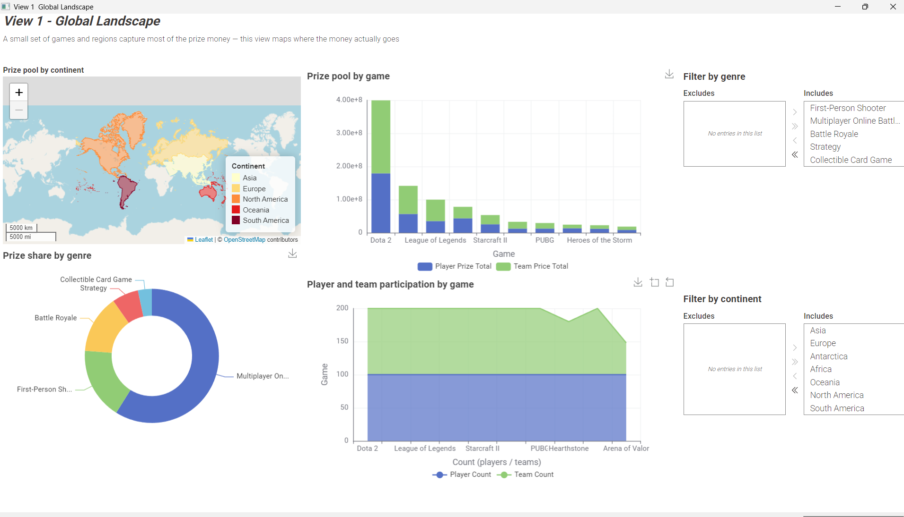
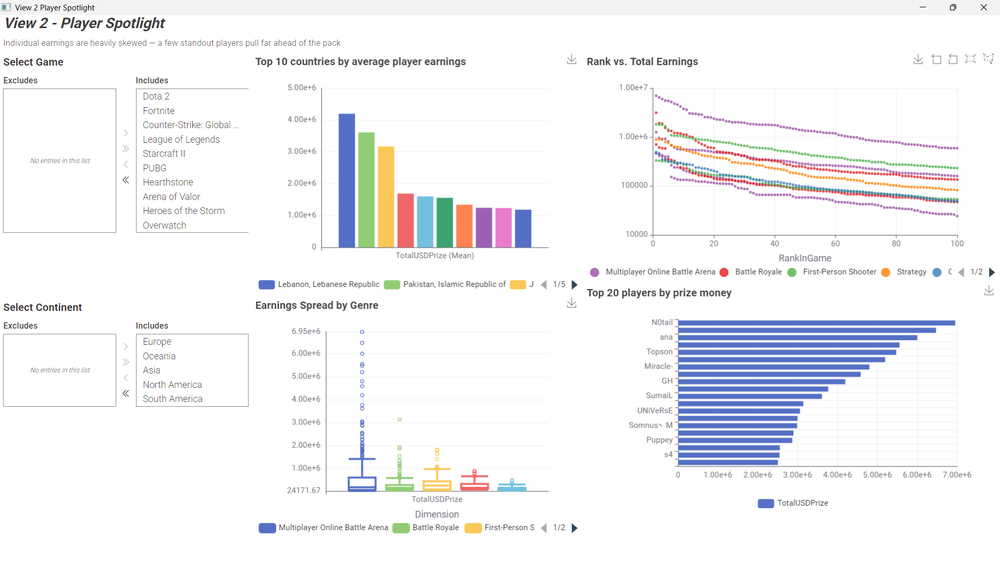
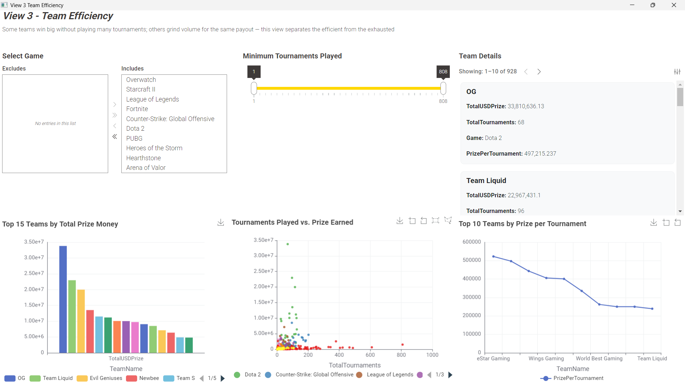

# Esports Prize Money — KNIME Data App

A KNIME Analytics Platform data app exploring how esports prize money is distributed across games, regions, and teams — built for the course **WIW64030 Analytics for Data Driven Decisions** (Prof. C. Laroque).

**Author:** Ashwin Gopi (Matriculation No. 62192)

## The Story

Prize money in esports isn't evenly spread — it's concentrated in a handful of games, a handful of countries, and a long tail of teams that convert tournament activity into cash at wildly different rates. This app is organized around three views that build on that narrative:

| View | Question it answers |
|---|---|
| **1. Global Landscape** | Where does the money concentrate — across games, genres, and regions? |
| **2. Player Spotlight** | Who earns it, and how skewed are individual earnings really? |
| **3. Team Efficiency** | Which teams convert tournaments into prize money most efficiently? |

## Dataset

Source: Kaggle "eSports Earnings" — 1,000 players, 928 teams, 10 games.

| File | Contents |
|---|---|
| `highest_earning_players.csv` | Player handle, country code, total USD prize, game, genre |
| `highest_earning_teams.csv` | Team name, total USD prize, tournament count, game, genre |
| `country-and-continent-codes-list.csv` | ISO country codes mapped to continent (262 reference rows), used to enrich players geographically |

**Source links:**
- Kaggle dataset: [eSports Earnings for Players & Teams by Game](https://www.kaggle.com/datasets/jackdaoud/esports-earnings-for-players-teams-by-game)
- Geodata for the World Map (View 1): *add the exact source you used* — e.g. if you loaded a shapefile/GeoJSON via KNIME's **GeoFile Reader**, the most common public source for continent/country boundaries is [Natural Earth](https://www.naturalearthdata.com/downloads/) (also accessible directly at [geojson.xyz](https://geojson.xyz/)). Swap this line for your actual source if different.

## Data Preparation

Cleaning and joining is done once, upstream of all three views, inside a labeled **Data Prep** component:

1. **Normalize country codes** — String Manipulation node uppercases `CountryCode` so it matches the reference table's casing.
2. **De-duplicate the reference table** — 8 transcontinental country codes (RU, TR, GE, AZ, AM, CY, KZ, UM) each map to two continents in the reference file. A Duplicate Row Filter (keyed on country code, keep-first) removes the extra rows before joining, avoiding row fan-out.
3. **Join players to geography** — a left-outer Joiner attaches `Continent_Name` and `Country_Name` to every player row.
4. **Derive efficiency metric** — a Math Formula node computes `PrizePerTournament = TotalUSDPrize / TotalTournaments` for teams.
5. **Rank within game** — a Rank node, partitioned by `Game` on `TotalUSDPrize`, run for both players and teams, powers "top N per game" views without hardcoding.
6. **Aggregate for the macro view** — GroupBy per Game/Genre/Continent produces the prize totals and counts feeding View 1.

### Data Quality Check

The reference file tags 8 transcontinental countries to two continents each. A naive join would duplicate every player from those countries, silently inflating country/continent totals ~2x and misreporting any chart grouped by continent or country. This was caught and fixed with a Duplicate Row Filter on the reference table (keep-first) applied inside the Data Prep component, before any downstream aggregation — so every player joins to exactly one continent.

## Views

### View 1 — Global Landscape

- Stacked bar chart: total prize pool by game
- Donut chart: prize pool share by genre
- World map: total prize by continent
- Stacked area chart: player vs. team prize pool per game

**Filters:** Genre (value filter), Continent (value filter)

### View 2 — Player Spotlight

- Bar chart: top 20 players by total prize
- Bar chart: average player earnings, top 10 countries
- Box plot: prize distribution by genre
- Scatter plot: in-game rank vs. earnings, colored by genre

**Filters:** Game (value filter), Continent (value filter)

### View 3 — Team Efficiency

- Bar chart: top 15 teams by total prize
- Scatter plot: tournaments played vs. total prize, by game
- Line chart: top 10 teams by prize-per-tournament
- Detail table linked to scatter selection

**Filters:** Game (value filter), minimum tournaments (slider)

## Self-Assessment Against Rubric

| Rubric item | How it's addressed |
|---|---|
| Meeting requirements | 3 views × 4 visualizations × 2 filters each, within the required 2–5 visualization / 1–3 filter ranges |
| Independence | Country-code casing and duplicate-continent-row issues identified and resolved without external help |
| Usability | Consistent filters, cross-page navigation, View 3 drill-down, safe empty-filter fallback |
| Data transformation | Normalization, dedup, geo-join, derived `PrizePerTournament` and per-game rank — isolated in a labeled Data Prep component |
| Visualization clarity & relevance | Every chart maps to one line of the concentration narrative, rather than a chart per column |

## Repository Contents

- `Folder.knar` — exported KNIME workflow (Data Prep + Views 1–3, assembled as a multi-page data app)
- `Analytics_for_data_driven_decisions_KNIME_Documentation.pptx` — submission documentation deck (this README summarizes its content)

## Requirements

- KNIME Analytics Platform 5.x
- KNIME extensions for the Data App / component views used (Value Filter Widget, Range Slider Filter Widget, Geospatial View, standard JS chart views)

## Usage

1. Import `Folder.knar` into KNIME Analytics Platform (**File → Import KNIME Workflow**).
2. Open the workflow and execute the Data Prep component first.
3. Open the assembled data app / composite view to interact with Views 1–3.
